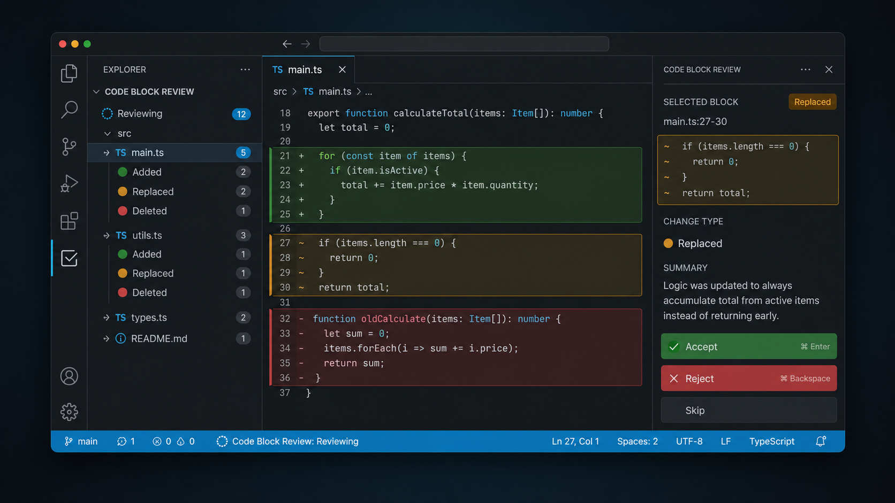

# Code Block Review

English | [简体中文](./README.zh-CN.md)

Code Block Review is a VS Code extension that turns working tree changes into structured review sessions, so you can inspect edits as blocks instead of raw file diffs.

It works well for:

- AI-assisted edits
- tool-generated edits
- manual follow-up edits
- mixed sessions where AI and human changes happen together

## Demo

Try the live demo here: [code-block-review-demo.html](https://liyuasam.github.io/Code-Block-Review/code-block-review-demo.html).

### Usage Preview

VS Code with inline block highlights, the Explorer review tree, and the dedicated review panel:



## Why It Exists

Modern coding tools can change multiple files quickly, but the resulting edits often land in the working tree as ordinary file modifications. That makes review harder than it should be.

Code Block Review adds a lightweight review layer on top of your workspace:

- group changes into a review session
- highlight added, deleted, and replaced blocks inline
- review by block, file, or all remaining files
- keep new edits inside the same session while review is still active

## Features

- Start a manual review session, or let always-on auto capture detect AI/tool-like edit bursts.
- Review changes as added, replaced, and deleted code blocks instead of scanning full-file diffs.
- Work directly in the editor with inline highlights, deletion summaries, and CodeLens actions.
- Use the Explorer review tree or the dedicated review panel for block-by-block navigation and comparison.
- Accept or reject a single block, the current file, or all remaining pending changes.
- Tune auto capture for noisy or large workspaces with ignore rules, scoped baselines, and localized settings.

## How It Works

### Manual flow

1. Run `Code Block Review: Start Review Session`
2. Make edits or let your AI tool edit code
3. Run `Code Block Review: Stop Capture And Review`
4. Review pending blocks directly in the editor, from the Explorer view, or in the review panel

### In-editor review flow

Each pending block is highlighted inline and gets a compact action row under the code block:

- `Accept` keeps the current block and jumps to the next pending block
- `Reject` restores the baseline version and jumps to the next pending block
- `Prev Block` / `Next Block` move between pending blocks without leaving the editor
- `Review` opens the dedicated side panel for a larger block-by-block comparison

### Automatic flow

When auto capture is enabled, the extension watches for edit bursts that look more like AI or tool output than ordinary typing.

After capture goes idle:

- the status bar switches to a `Ready` state
- the notification action starts review and jumps to the first pending block
- you can still open the dedicated review panel at any time
- or let the session expire and silently merge into the new baseline
- the default Ready wait time is 120 seconds
- set `codexReview.autoCapture.reviewOfferSeconds` to `0` to keep Ready sessions waiting indefinitely until you review or skip them manually
- if Git HEAD/ref changes during capture or Ready, the session is released to avoid stale reviews after branch switches

### Auto-capture heuristics

Auto capture uses a short observation window. It starts a review session when it sees signals such as a large single edit, coordinated multi-file changes, or many unique lines changing in a burst. Very dense edit events are treated as a supporting signal, not as the only reason to start capture.

In practice, the decision order is:

| Situation | Main signal | Result |
| --- | --- | --- |
| One edit is already very large | `largeChangeLines` or `largeChangeChars` | Capture starts |
| Multiple files change together | `multiFileMinFiles` and `multiFileMinLines` | Capture starts |
| Many unique lines change inside the short window | `burstMinLines` | Capture starts |
| Edit events are extremely dense | `burstEventWindowMilliseconds` + `burstMinEvents` | Only assists the rules above |

For large multi-project workspaces, `codexReview.autoCapture.scope` controls how much of the workspace is scanned into the baseline. The default `touchedProjects` focuses on the active and recently touched projects.

## Configuration

The extension currently supports configuration for:

- ignored file globs
- optional inline block badges
- auto capture behavior, scope, and timing
- review offer timeout; set `codexReview.autoCapture.reviewOfferSeconds` to `0` to keep Ready sessions until they are handled manually
- burst-detection thresholds and diagnostic logging

Open the extension settings panel for the full list.

## Local Development

1. Open this folder in VS Code
2. Press `F5` to launch an Extension Development Host

Quick validation:

```bash
npm run check
```

## Status

Code Block Review is already usable and under active iteration. The current version focuses on making review sessions practical for real AI-assisted coding workflows.

## Links

- Repository: https://github.com/LiYuAsam/Code-Block-Review
- Issues: https://github.com/LiYuAsam/Code-Block-Review/issues
